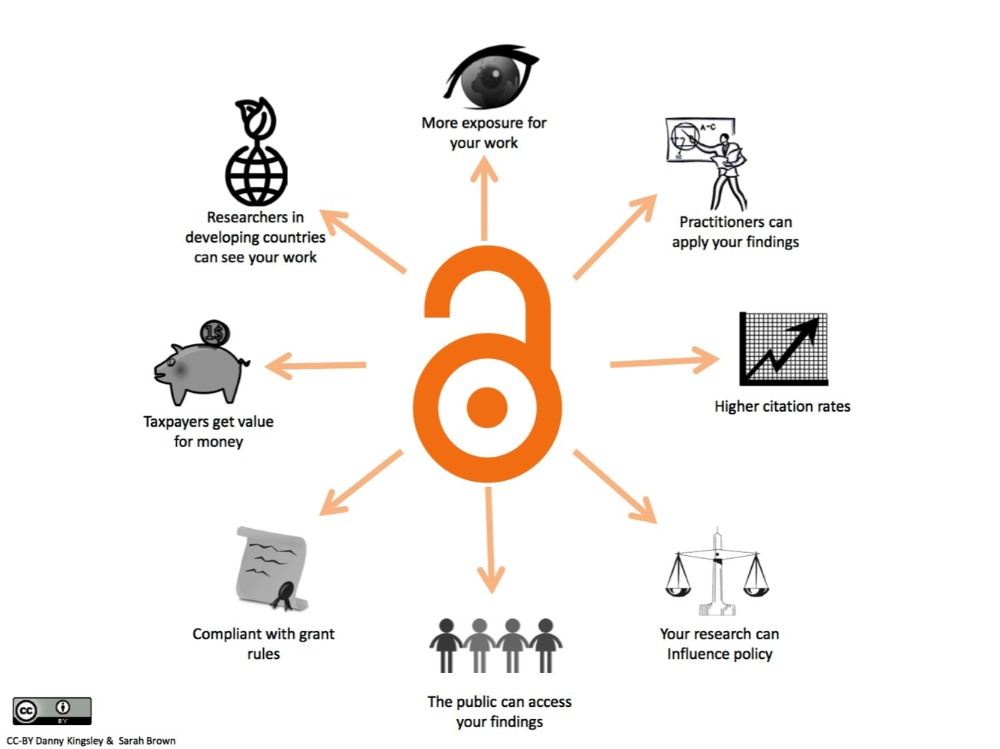
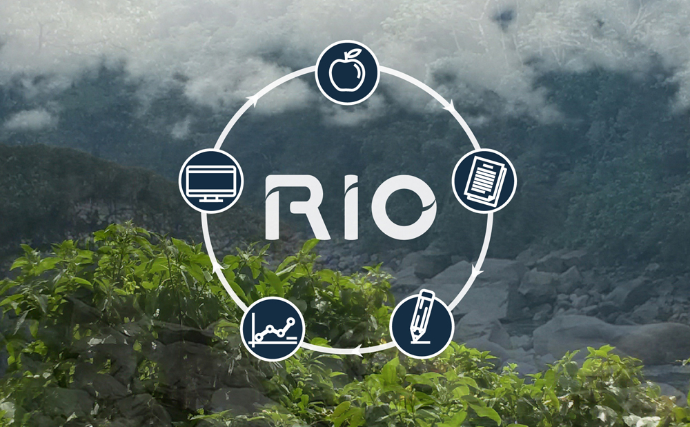
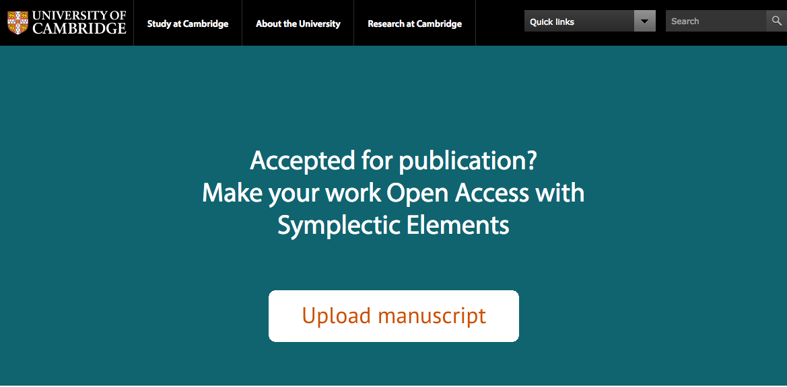

# Data Sharing

Avoiding data disasters

Best practices in Research Data Management for the Biological Sciences

12 July 2017

---
# Why sharing is important?

 <!-- .element height="60%" width="60%" -->

---
# Some other very important reasons to share

- Open Research is fundamental to being an academic
- Research relies on the principle that we share our findings
- Ideas and results need to be shared to move our knowledge forward

---
# What about negative results?

 <!-- .element height="30%" width="30%" -->

- https://riojournal.com/ RIO - Research Ideas and Outcomes - journal publishes all outputs of the research cycle

----

- Scientific data https://www.nature.com/sdata/ is a journal for descriptions of scientifically valuable datasets, and research that advances the sharing and reuse of scientific data
- Pre-register your study in particular journal

---
# Would you consider Pre-Print?

http://www.biorxiv.org/

By posting preprints on bioRxiv, authors are able to make their findings immediately available to the scientific community and receive feedback on draft manuscripts before they are submitted to journals.

---
# Open Access policies to publications

You must ensure:

- An electronic copy of final, published form of your paper is available on [Europe PubMed Central (Europe PMC)](https://europepmc.org/) as soon as possible and no later than 6 months after publication.

----

- If you've paid an article processing charge for the Europe PMC deposit, your paper must be published with a  license, so that it may be freely copied and reused, providing that the original authors are properly credited. Other licenses will not be compliant with your Grant Conditions.
- The journal you publish in must be published by a publisher who has agreed to the [Wellcome Trust publisher requirements](https://wellcome.ac.uk/funding/managing-grant/publisher-requirements).

---
# Public good

"Publicly funded research data are a public good, produced in the public interest, which should be made openly available with as few restrictions as possible..."

http://www.rcuk.ac.uk/research/datapolicy/

---
# Making your publication Open Access

https://www.openaccess.cam.ac.uk/

The Open Access Team will check your funder and journal policies and advise on how to comply with REF and other funder Open Access requirements.

 <!-- .element height="60%" width="60%" -->

---
# How to share data?

Deposit your data in suitable public data repositories and add a link to your data in your publication

 With exceptions for personal and sensitive data

EBI data submission
https://www.ebi.ac.uk/services

---
# Keep your notebook informative

---

# Key information about the experiment

- Think of data submission
- Keep a ReadMe file

---

# ReadMe file template

---

# Electronic note keeping vs paper based solution
