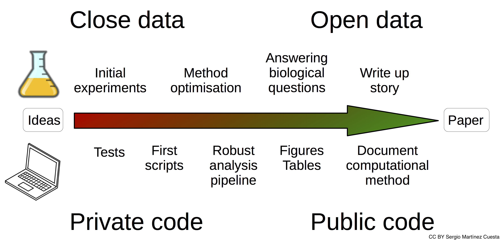
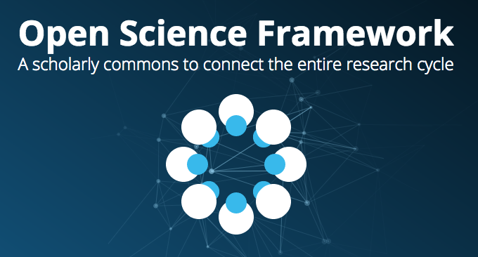
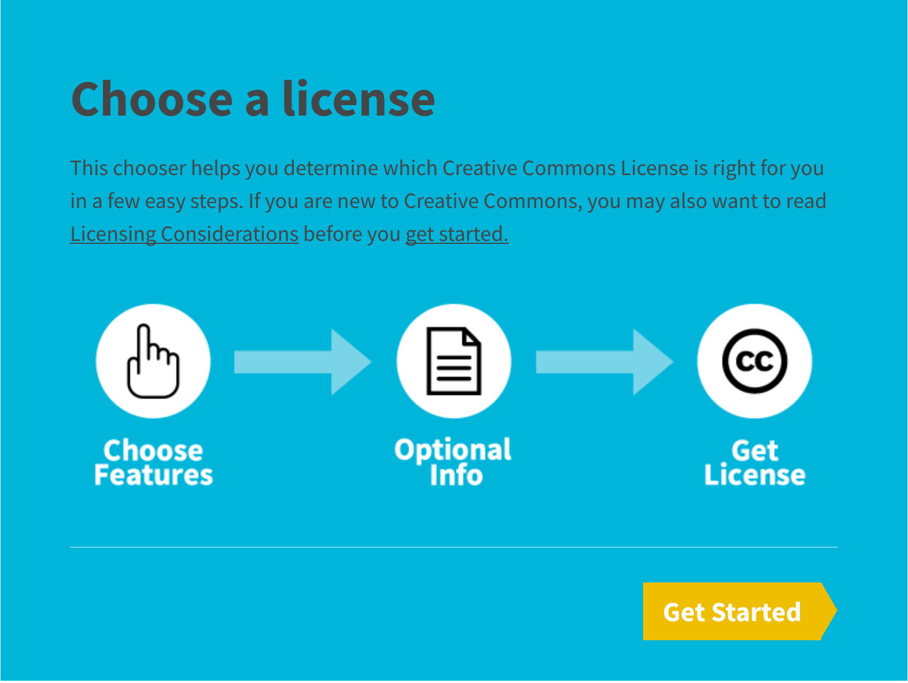
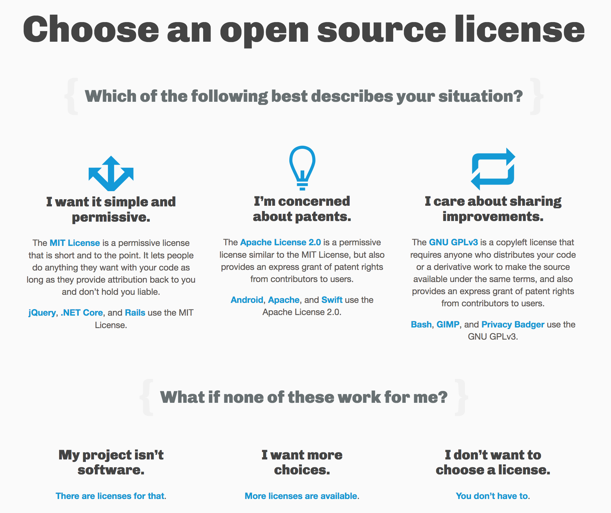

# Data Sharing

Avoiding data disasters

Best practices in Research Data Management for the Biological Sciences

Anne Pajon, CRUK Cambridge Institute

23 February 2018

 This work is licensed under the [Creative Commons Attribution 4.0 International License](http://creativecommons.org/licenses/by/4.0/).

----
# Data Sharing

- What data are you currently sharing?
- When are you sharing? and with who?
- How do you do it?

----
# Data Sharing

- Why sharing is important?
- What data to share?
- When to share?
- How to share data?
- Under which license?

---
# Why sharing is important?

 <!-- .element height="60%" width="60%" -->

----
# Some other very important reasons to share

- Open Research is fundamental to being an academic
- Research relies on the principle that we share our findings
- Ideas and results need to be shared to move our knowledge forward

----
# Open Access policies to publications

You must ensure:

- An electronic copy of final, published form of your paper is **available on [Europe PubMed Central (Europe PMC)](https://europepmc.org/)** as soon as possible and no later than 6 months after publication.

----

- Your paper must be **published with a  license**, so that it may be freely copied and reused, providing that the original authors are properly credited. Other licenses will not be compliant with your Grant Conditions.
- The journal must also belong to a publisher who has agreed to the [Wellcome Trust publisher requirements](https://wellcome.ac.uk/funding/managing-grant/publisher-requirements).

----
# Data Management plans

Compulsory part of grant application

http://www.data.cam.ac.uk/data-management-guide

----

"Publicly funded research data are a **public good**, produced in the public interest, which should be made **openly available** with as few restrictions as possible..."

http://www.rcuk.ac.uk/research/datapolicy/

---
# What data to share?

- papers
  - results and figures
- processed data
- raw data and associated metadata
- methods used
- software and scripts

----
# Open Access journals

https://doaj.org/

DOAJ is a community-curated online directory that indexes and provides access to **high quality, open access, peer-reviewed journals**.

----
# What about non-positive results?

 <!-- .element height="30%" width="30%" -->

https://riojournal.com/

RIO - Research Ideas and Outcomes - journal publishes all outputs of the research cycle

----

- [Scientific Data](https://www.nature.com/sdata/) is a peer-reviewed, open-access journal for descriptions of scientifically valuable datasets, and research that advances the sharing and reuse of scientific data.

- Pre-register your study in particular journals

---
# When to share?

----
# Would you consider Pre-Print?

http://www.biorxiv.org/

By posting preprints on bioRxiv, authors are able to make their findings immediately available to the scientific community and receive feedback on draft manuscripts before they are submitted to journals.

----
# Making your publication Open Access

https://www.openaccess.cam.ac.uk/

The Open Access Team will check your funder and journal policies and advise on how to comply with Open Access requirements.

 <!-- .element height="60%" width="60%" -->

---
# How to share data?

Store, describe and deposit your data in **suitable** public data repositories and add a **link to your data** in your publication

 with exceptions for personal and sensitive data: do not collect it! Use anonymized data instead.

Unsure if your strategy is right? Contact UIS Information Management team at mailto:informationmanagement@uis.cam.ac.uk

----
# Repositories for datasets

- Discipline specific
  - Registry of Research Data Repositories http://www.re3data.org/
  - EMBL-EBI services https://www.ebi.ac.uk/services
- General purpose
  - Zenodo https://zenodo.org/

----
# Repositories for software

- GitHub https://github.com
- GitLab https://gitlab.com
- Bitbucket https://bitbucket.org

Zenodo https://zenodo.org/ assigns a **Digital Object Identifier (DOI)** to make the upload easily and uniquely citeable, with GitHub integration to enable tracking of each release.

----
# Gather information early

- Think of data submission from the start
- Collect metadata before submission
- Keep a ReadMe file about your project
- Consider using an electronic notebook

----
# Open Science Framework

https://osf.io/

Cloud-based management for your projects

---
# Under which license?

- Creative Commons licenses https://creativecommons.org/
- Software licenses https://choosealicense.com/

----
# Creative Commons

----
# Software licenses

---
# Extras

- ORCiD: Open Researcher and Contributor ID https://orcid.org/
- Training and support http://www.data.cam.ac.uk/events/

---
# Conclusion

- Sharing is essential for publicly funded research
- Ideally most data should be shared
- Share as early as possible
- Using suitable repositories and DOI
- Under Creative Commons or Open Source license

---
Many thanks!

 <!-- .element height="10%" width="10%" -->

Questions?
